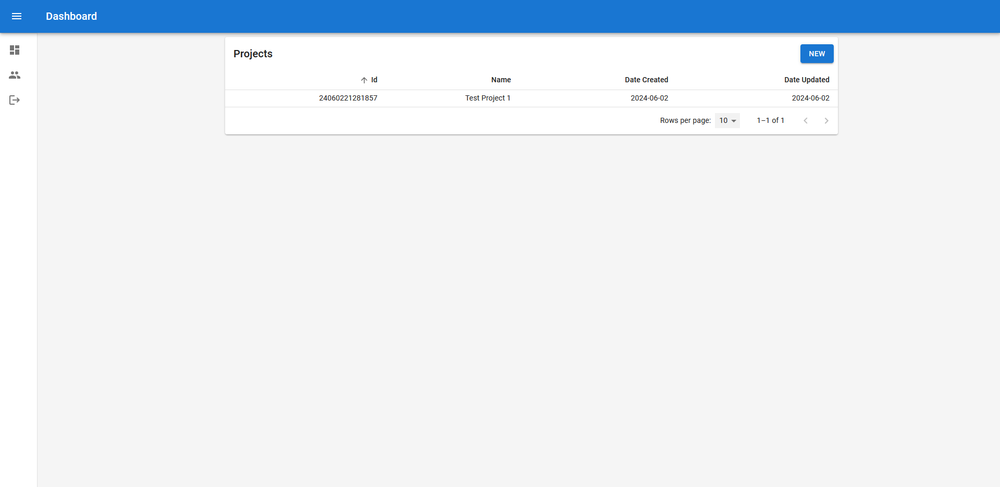
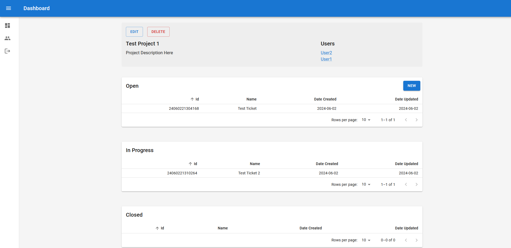
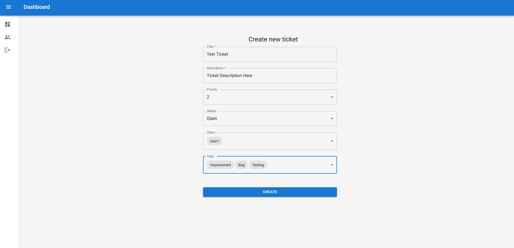
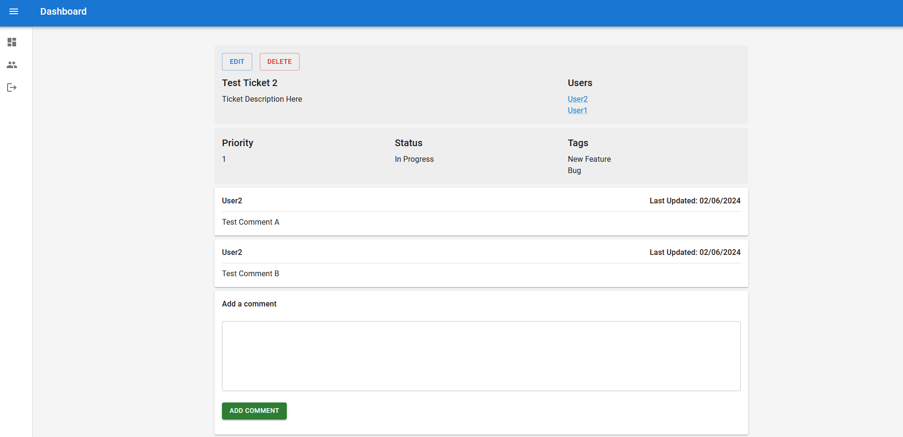

## BugTracker

An application used to track bugs in projects, built with React, TypeScript, and .NET.

## Project Status

This project is in development. Users can create projects and tickets for projects to track their progress.

## Project Screen Shot(s)

## Installation and Setup Instructions

#### Example:  

Clone down this repository. You will need `node` and `npm` installed globally on your machine.  

Installation:

In `bugtracker.client`:

run `npm install`

In `BugTracker.Server`:

run `dotnet restore`

To run the project (both the React application and the .NET server), go to `BugTracker.Server`:

run `dotnet watch`